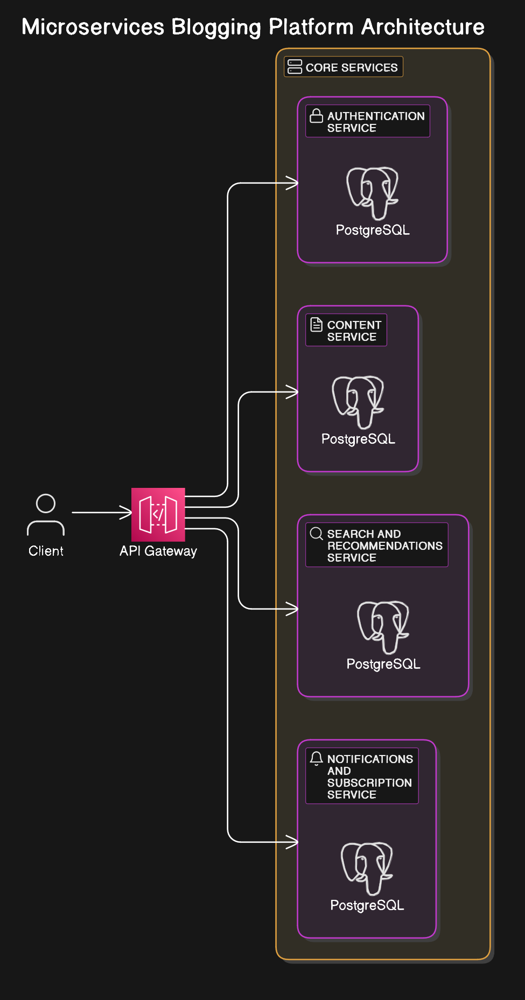

# Blogging Microservices Application

### Basic Architecture Diagram (WIP)

##### Authentication Service

- C# ASP.NET, PostgreSQL
- Implements OAuth 2.0 Client Credentials Flow
- Issues JWTs
- Manages User Data

##### Content Service

- Java Spring Boot, PostgreSQL
- Manages CRUD for Blog Posts

##### Search / Recommendation Service

- Golang, Undecided
- Creates the feed for users
- Based on Preference indicators (Likes, Dislikes, etc.)

##### Notification and Subscription Service

- Python
- Sends notifications based on user subscriptions
