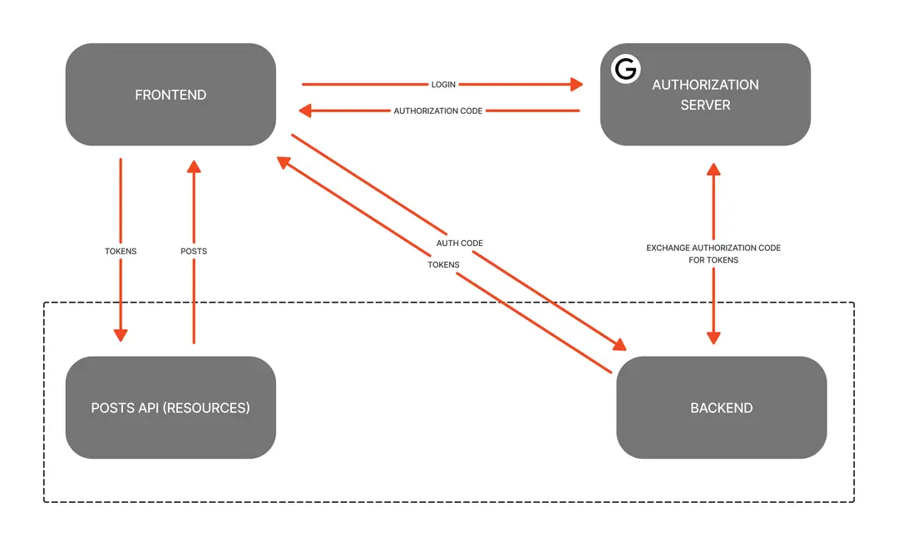

# Auth Service

### Functional Requirements

Implements Oauth Client Credentials flow as depicted below

1. The Frontend will initiate a popup that allows the user to login using their account
2. The Authorization Server(Google) will issue an access code to the client
3. The client will then send the access code via a POST request to this backend, allowing it to access the GoogleApi on their behalf
4. If the access code is valid, the client will recieve a JWT authorizing them to access protected Resources
   

### Non-Functional Requirements

- Login process should be intuitive, with clear error messages and recovery options.
- Should maintain audit logs and detect unauthorized access attempts.
- Authentication requests should be processed within 500ms under normal load conditions
- Must use industry-standard encryption for credentials and sensitive data
